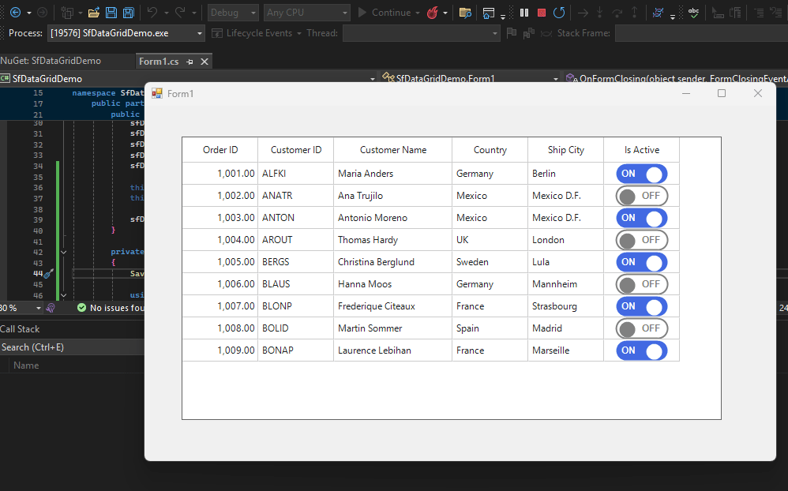

# How to serialize and Deserialize records and toggle switch column in WinForms SfDataGrid?

By default, [WinForms DataGrid](https://www.syncfusion.com/winforms-ui-controls/datagrid) (SfDataGrid) does not serialize records. To achieve this, a custom implementation is required for saving and loading data using Save and Load methods. Since the Toggle column is a custom column, serialization and deserialization can be accomplished by creating a custom [SerializableGridColumn](https://help.syncfusion.com/cr/windowsforms/Syncfusion.WinForms.DataGrid.Serialization.SerializableGridColumn.html) for Toggle switch column. Additionally, the [SerializationController](https://help.syncfusion.com/cr/windowsforms/Syncfusion.WinForms.DataGrid.Serialization.SerializationController.html) class should be overridden to manage the serialization and deserialization processes specific to this custom column.

**Code snippet of SerializableGridToggleButtonColumn class:**
```csharp
[DataContract(Name = "GridToggleButtonColumn")]
public class SerializableGridToggleButtonColumn : SerializableGridColumn
{
    public SerializableGridToggleButtonColumn()
    {
        
    }
}
```
**Code snippet of SerializationController class:**
```csharp
sfDataGrid1.SerializationController = new SerializationControllerExt(this.sfDataGrid1);  

public class SerializationControllerExt : SerializationController
{
    public SerializationControllerExt(SfDataGrid grid) : base(grid) { }

    SerializableGridColumn serializableColumn = new SerializableGridColumn();


    // To serialize the GridToggleColumn
    protected override SerializableGridColumn GetSerializableGridColumn(GridColumn column)
    {
        if(column is GridToggleButtonColumn)
        {;
            serializableColumn = new SerializableGridToggleButtonColumn();               
            return serializableColumn;
        }

        return base.GetSerializableGridColumn(column);
    }

    // To Deserialize the GridToggleColumn
    protected override GridColumn GetGridColumn(SerializableGridColumn serializableColumn)
    {
        if (serializableColumn is SerializableGridToggleButtonColumn)
        {
            var toggleButtonColumn = new GridToggleButtonColumn();
            return toggleButtonColumn;
        }
        return base.GetGridColumn(serializableColumn);
    }

    // To add the SerializableGridToggleButtonColumn as a KnownTypes to serialize and deserialize
    public override Type[] KnownTypes()
    {
        return base.KnownTypes().Concat(new Type[] { typeof(SerializableGridToggleButtonColumn) }).ToArray();
    }
}
```

**Code snippet of Save and Load Data:**

```csharp
private void SaveData()
{
    var serializer = new System.Xml.Serialization.XmlSerializer(typeof(List<OrderInfo>));
    using (var stream = File.Create("OrdersData.xml"))
    {
        serializer.Serialize(stream, _orderInfos.Orders);
    }
}

private List<OrderInfo> LoadData()
{
    var serializer = new System.Xml.Serialization.XmlSerializer(typeof(List<OrderInfo>));
    using (var stream = File.OpenRead("OrdersData.xml"))
    {
        return (List<OrderInfo>)serializer.Deserialize(stream);
    }
}
```

**Code snippet of Serialization and Deserialization in Form loaded event and Form closing event:**

```csharp
this.Load += OnFormLoading;

private void OnFormLoading(object? sender, EventArgs e)
{
    if (File.Exists("OrdersData.xml"))
    {
        _orderInfos.Orders = LoadData();
        sfDataGrid1.DataSource = _orderInfos.Orders;
    }

    if (File.Exists("DataGrid.xml"))
    {
        using (var file = File.Open("DataGrid.xml", FileMode.Open))
        {
            sfDataGrid1.Deserialize(file);
        }
    }          
}

this.FormClosing += OnFormClosing;

private void OnFormClosing(object? sender, FormClosingEventArgs e)
{
    SaveData();
    
    using (var file = File.Create("DataGrid.xml"))
    {            
        sfDataGrid1.Serialize(file);
    }
}
```



Take a moment to peruse the [WinForms DataGrid - Serialization and Deserialization](https://help.syncfusion.com/windowsforms/datagrid/serializationdeserialization) documentation, where you can find about the serialization and deserialization with code examples.
